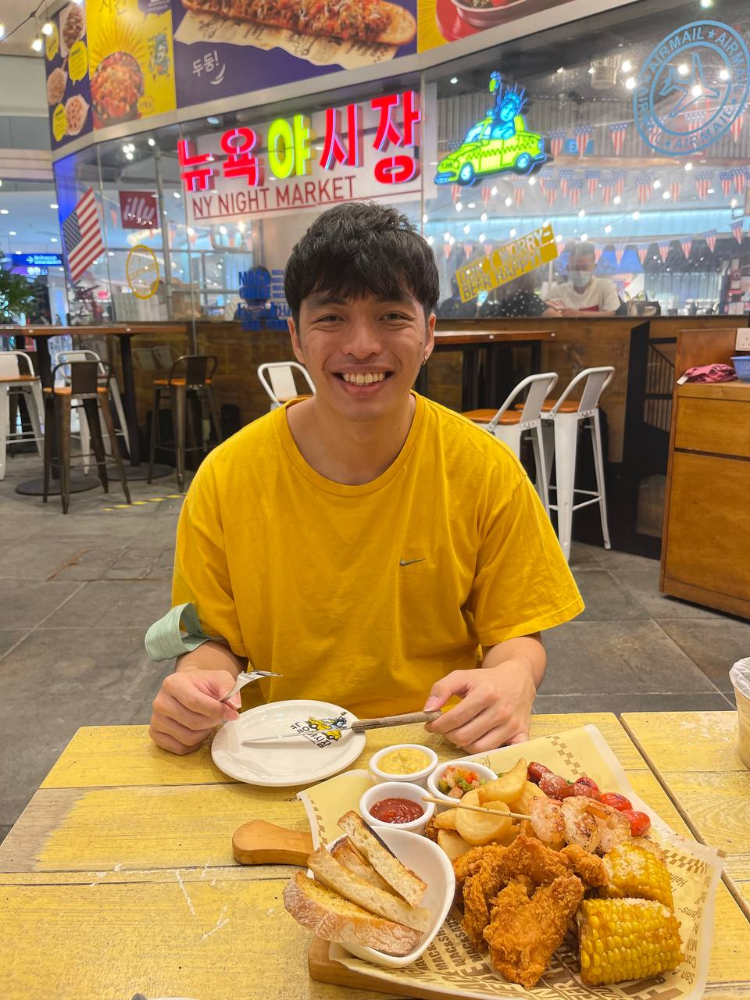
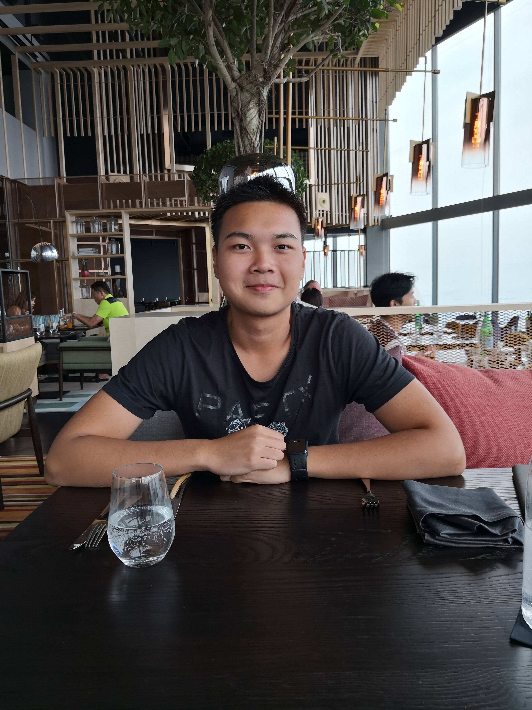
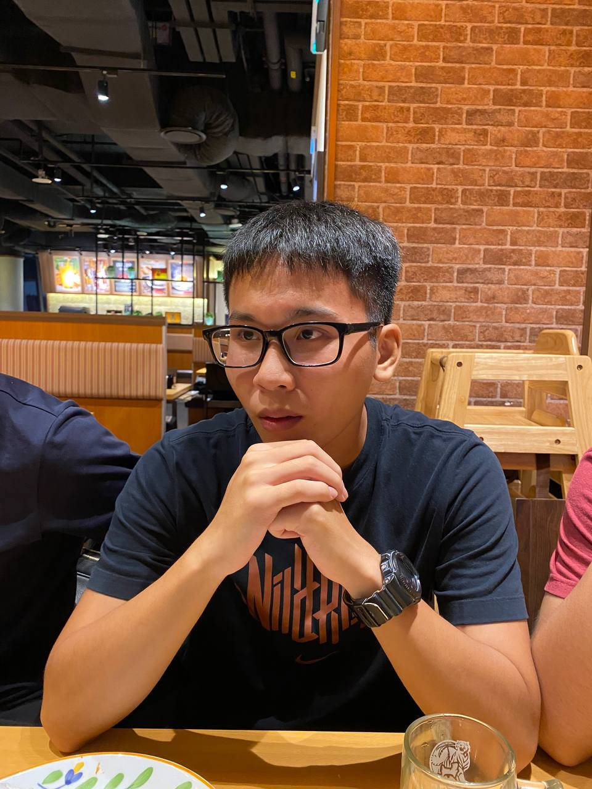

## FoodOnWheels

We are a team based in the [School of Computing, National University of Singapore](http://www.comp.nus.edu.sg).

## Project team

### Jaegar Poon Yu Yao

[[github](https://github.com/jaegarpoon)] [[portfolio](team/jaegarpoon.md)]

* Role: Developer
* Responsibilities: `Dish` related classes, Code Quality, Testing, Documentation

### Goh Zi Xuan

[[github](https://github.com/zxgoh)] [[portfolio](team/zxgoh.md)]

* Role: Developer
* Responsibilities: `Customer` related classes, Code Quality, Testing, Documentation

### Nguyen Minh Hieu

[[github](http://github.com/hieunm1821)]
[[portfolio](team/hieunm1821.md)]

* Role: Developer
* Responsibilities: `Driver` related classes, Code Quality, Testing, Documentation

### Xing Zheng

[[github](http://github.com/xzzz3)]
[[portfolio](team/xzzz3.md)]

* Role: Developer
* Responsibilities: `Order` related classes, Code Quality, Testing, Documentation
