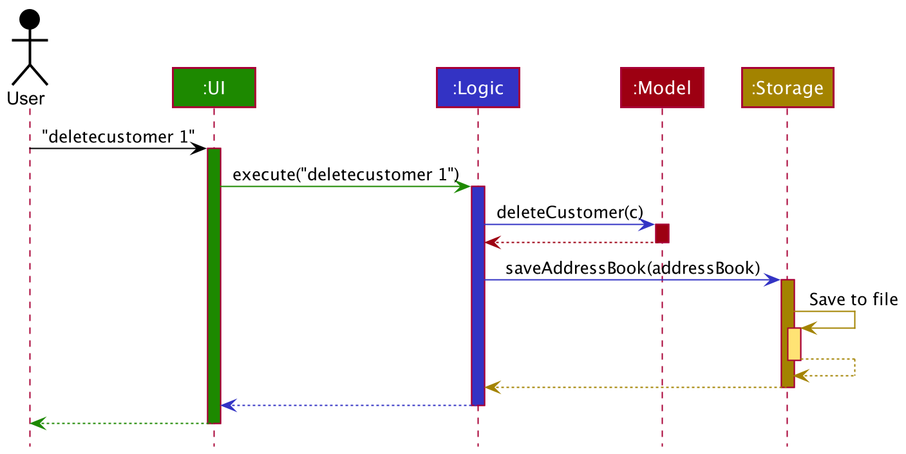
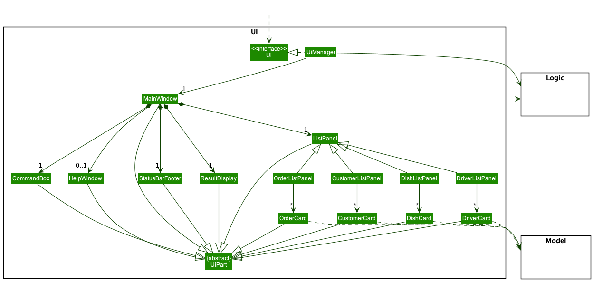
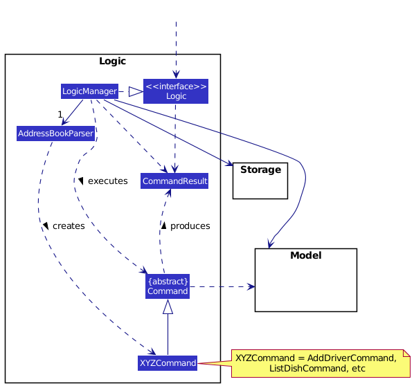
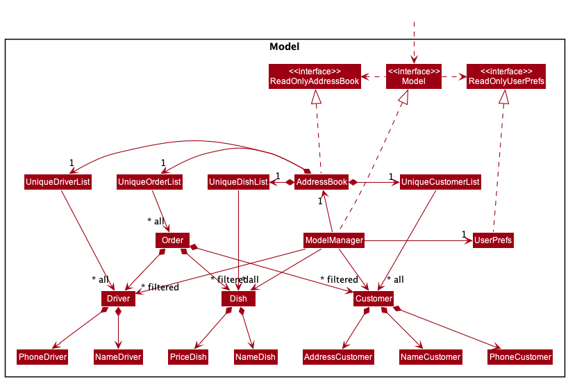
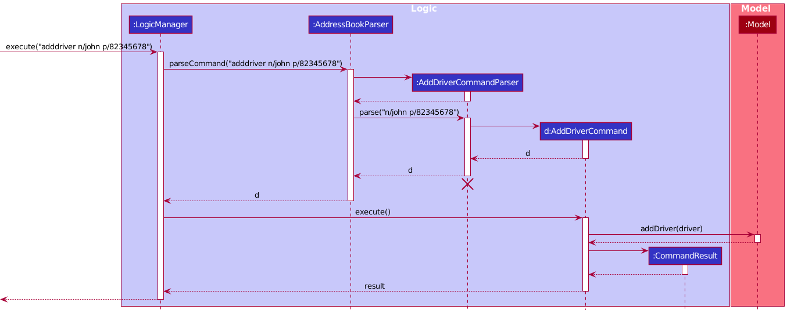
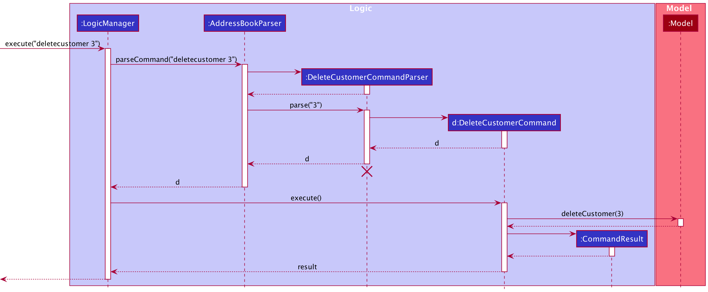
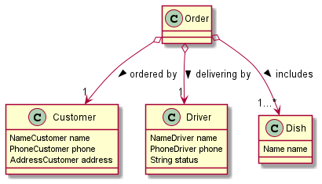
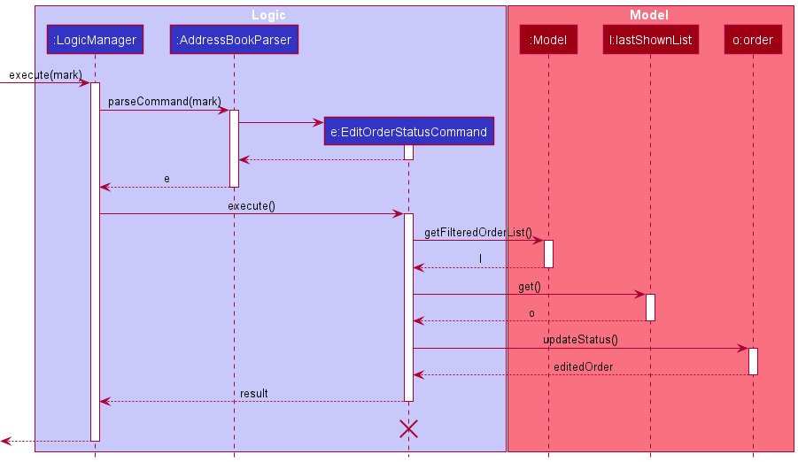

## Table of Contents
1. [Acknowledgements](#acknowledgements)    
2. [Setting up, getting started](#setting-up-getting-started)   
3. [Design](#design)    
   3.1 [Architecture](#architecture)    
   3.2 [UI component](#ui-component)    
   3.3 [Logic component](#logic-component)  
   3.4 [Model component](#model-component)  
   3.5 [Storage component](#storage-component)  
4. [Implementation](#feature-implementation)    
   4.1 [Add/Delete Driver](#adddelete-driver-feature)   
   4.2 [List Driver](#list-driver-feature)  
   4.3 [Add/Delete Customer](#add-customer-feature)    
   4.4 [List Customer](#list-customer-feature)  
   4.5 [Add/Delete/List Dish](#adddeletelist-dish-feature)  
   4.6 [Tab Display](#tab-display-feature)  
   4.7 [Add Order](#add-order-feature)  
   4.8 [Edit Order Status](#edit-order-status-feature)  
   4.9 [List Order](#list-order-feature)  
   4.10 [Revenue](#revenue-feature)  
5. [Documentation, logging, testing, configuration, dev-ops](#documentation-logging-testing-configuration-dev-ops)  
6. [Appendix: Requirements](#appendix-requirements) 
7. [Appendix: Instructions for manual testing](#appendix-instructions-for-manual-testing)   

--------------------------------------------------------------------------------------------------------------------

## **Acknowledgements**

* This project is based on the AddressBook-Level3 project created by the [SE-EDU initiative](https://se-education.org).

--------------------------------------------------------------------------------------------------------------------

## **Setting up, getting started**

Refer to the guide [_Setting up and getting started_](SettingUp.md).

--------------------------------------------------------------------------------------------------------------------

## **Design**

:bulb: **Tip:** The `.puml` files used to create diagrams in this document can be found in the [diagrams](https://github.com/AY2122S2-CS2103-F10-2/tp/tree/master/docs/diagrams) folder. Refer to the [_PlantUML Tutorial_ at se-edu/guides](https://se-education.org/guides/tutorials/plantUml.html) to learn how to create and edit diagrams.

### Architecture

The ***Architecture Diagram*** given above explains the high-level design of the App.

Given below is a quick overview of main components and how they interact with each other.

**Main components of the architecture**

**`Main`** has two classes called [`Main`](https://github.com/AY2122S2-CS2103-F10-2/tp/blob/master/src/main/java/seedu/address/Main.java) and [`MainApp`](https://github.com/AY2122S2-CS2103-F10-2/tp/blob/master/src/main/java/seedu/address/MainApp.java). It is responsible for,
* At app launch: Initializes the components in the correct sequence, and connects them up with each other.
* At shut down: Shuts down the components and invokes cleanup methods where necessary.

[**`Commons`**](#common-classes) represents a collection of classes used by multiple other components.

The rest of the App consists of four components.

* [**`UI`**](#ui-component): The UI of the App.
* [**`Logic`**](#logic-component): The command executor.
* [**`Model`**](#model-component): Holds the data of the App in memory.
* [**`Storage`**](#storage-component): Reads data from, and writes data to, the hard disk.

**How the architecture components interact with each other**

The *Sequence Diagram* below shows how the components interact with each other for the scenario where the user 
issues the command `deletecustomer 1`.

Each of the four main components (also shown in the diagram above),

* defines its *API* in an `interface` with the same name as the Component.
* implements its functionality using a concrete `{Component Name}Manager` class (which follows the corresponding API `interface` mentioned in the previous point.

For example, the `Logic` component defines its API in the `Logic.java` interface and implements its functionality using the `LogicManager.java` class which follows the `Logic` interface. Other components interact with a given component through its interface rather than the concrete class (reason: to prevent outside component's being coupled to the implementation of a component), as illustrated in the (partial) class diagram below.

The sections below give more details of each component.

### UI component

The **API** of this component is specified in [`Ui.java`](https://github.com/AY2122S2-CS2103-F10-2/tp/blob/master/src/main/java/seedu/address/ui/Ui.java)

The UI consists of a `MainWindow` that is made up of parts e.g.`CommandBox`, `ResultDisplay`, `ListPanel`, `StatusBarFooter` etc. All these, including the `MainWindow`, inherit from the abstract `UiPart` class which captures the commonalities between classes that represent parts of the visible GUI.

The `UI` component uses the JavaFx UI framework. The layout of these UI parts are defined in matching `.fxml` files that are in the `src/main/resources/view` folder. For example, the layout of the [`MainWindow`](https://github.com/AY2122S2-CS2103-F10-2/tp/blob/master/src/main/java/seedu/address/ui/MainWindow.java) is specified in [`MainWindow.fxml`](https://github.com/AY2122S2-CS2103-F10-2/tp/blob/master/src/main/resources/view/MainWindow.fxml)

The `UI` component,

* executes user commands using the `Logic` component.
* listens for changes to `Model` data so that the UI can be updated with the modified data.
* keeps a reference to the `Logic` component, because the `UI` relies on the `Logic` to execute commands.
* depends on some classes in the `Model` component, as it displays `Person` object residing in the `Model`.

### Logic component

**API** : [`Logic.java`](https://github.com/AY2122S2-CS2103-F10-2/tp/blob/master/src/main/java/seedu/address/logic/Logic.java)

Here's a (partial) class diagram of the `Logic` component:

How the `Logic` component works:
1. When `Logic` is called upon to execute a command, it uses the `AddressBookParser` class to parse the user command.
1. This results in a `Command` object (more precisely, an object of one of its subclasses e.g., `AddDriverCommand`) which is executed by the `LogicManager`.
1. The command can communicate with the `Model` when it is executed (e.g. to add a person).
1. The result of the command execution is encapsulated as a `CommandResult` object which is returned back from `Logic`.

The Sequence Diagram below illustrates the interactions within the `Logic` component for the `execute("deletecustomer 
3")` 
API call.

:information_source: **Note:** The lifeline for `DeleteCommandParser` should end at the destroy marker (X) but due to a limitation of PlantUML, the lifeline reaches the end of diagram.

Here are the other classes in `Logic` (omitted from the class diagram above) that are used for parsing a user command:

How the parsing works:
* When called upon to parse a user command, the `AddressBookParser` class creates an `XYZCommandParser` 
(`XYZ` is a placeholder for the specific command name e.g., `AddDriverCommandParser`) which uses the other classes
shown above to parse the user command and create a `XYZCommand` object (e.g., `AddDriverCommand`) which the `AddressBookParser` returns back as a `Command` object.
* All `XYZCommandParser` classes (e.g., `AddDriverCommandParser`, `DeleteDriverCommandParser`, ...) inherit from the `Parser` interface so that they can be treated similarly where possible e.g, during testing.

### Model component
**API** : [`Model.java`](https://github.com/AY2122S2-CS2103-F10-2/tp/blob/master/src/main/java/seedu/address/model/Model.java)

The `Model` component,

* stores the FoodOnWheels data i.e., all `Dish/Customer/Driver/Order` objects (`Dish` objects are contained in a `UniqueDishList` object, `Customer` objects are contained in a `UniqueCustomerList` object, etc.).
* stores the currently 'selected' `Dish/Customer/Driver/Order` objects (e.g., results of a search query) as a separate _filtered_ list which is exposed to outsiders as an unmodifiable `ObservableList<>` that can be 'observed' e.g. the UI can be bound to this list so that the UI automatically updates when the data in the list change.
* stores a `UserPref` object that represents the user’s preferences. This is exposed to the outside as a `ReadOnlyUserPref` objects.
* does not depend on any of the other three components (as the `Model` represents data entities of the domain, they should make sense on their own without depending on other components)

### Storage component

**API** : [`Storage.java`](https://github.com/AY2122S2-CS2103-F10-2/tp/blob/master/src/main/java/seedu/address/storage/Storage.java)

(todo: update storage class diagram)

The `Storage` component,
* can save both address book data and user preference data in json format, and read them back into corresponding objects.
* inherits from both `AddressBookStorage` and `UserPrefStorage`, which means it can be treated as either one (if only the functionality of only one is needed).
* depends on some classes in the `Model` component (because the `Storage` component's job is to save/retrieve objects that belong to the `Model`)

### Common classes

Classes used by multiple components are in the `seedu.addressbook.commons` package.

--------------------------------------------------------------------------------------------------------------------

## **Feature Implementation**

This section describes some noteworthy details on how certain features are implemented.

### Add/Delete/Edit Driver feature

#### Implementation

The add/delete/list driver feature are commands which inherits from `Command`. These are the basic commands
to add, remove or view `Driver` objects.

#### Example run-through

Given below is a successful usage scenario of the commands.

Step 1. The user executes the `adddriver`, `deletedriver` and `editdriver` command in the application to add, delete or 
edit the driver, which is handled by `Logic#execute`.

Step 2. The command entered is parsed by the `AddressBookParser#parseCommand`.

Step 3. The `adddriver`, `deletedriver` and `editdriver` command will then be parsed by `AddDriverCommandParser#parse`,
`EditDriverCommandParser#parse` and `DeleteDriverCommandParser#parse` to create a new `AddDriverCommand`,
`DeleteDriverCommand` and `EditDriverCommand` respectively.

Step 4. The `Logic` component then performs the `Command#execute()` method in the respective commands

Step 5. A new `CommandResult` with the success message is returned to `Logic` and returned as the output.

### List Driver feature

#### Implementation

The list driver mechanism is faciliated by `Driver` and `DriverStatus`. The latter is an enumeration class to include the possible statuses.

Given below is an example usage scenario and how the list order mechanism behaves at each step.

Step 1. The user executes the `listdriver free` command in the application to list the free driver.
The `listdriver` keyword is parsed by the `AddressBookParser#parseCommand` and `ListDriverCommandParser#parse` to create a new `ListDriverCommand` with the provided status.

Step 2. The `Logic` then executes the `ListDriverCommand#execute()`.

Step 3. A new `CommandResult` with the success message is returned to `Logic` and returned as the output, with the orders of `DriverStatus#FREE` being displayed.

### Add Customer feature

#### Implementation

The add customer mechanism is facilitated by `Customer`. It is a model in the application and some of its important
attributes include:

* `NameCustomer`  — Contains the name of the given customer
* `PhoneCustomer`  — Contains the phone number of the given customer
* `AddressCustomer`  — Contains the address of the given customer

These attributes are used in the `customer#Customer()` instantiation, which is called to create a new Customer when the
add customer  
command is called.

Given below is an example usage scenario and how the add customer mechanism behaves at each step.

Step 1. The user executes the `addcustomer n/john p/12345678 a/nus` command in the application to add a given
customer, which is handled by `Logic#execute`.
The `addcustomer` command is parsed by the `AddressBookParser#parseCommand` and `AddCustomerCommandParser#parse` to
create a new
`AddCustomerCommand` with the given phone number and dishes.

Step 2. The `Logic` then executes the `AddCustomerCommand#execute()` with a `Customer` object

Step 3. The `Customer` object, which contains the following attributes `NameCustomer` `PhoneCustomer`
`AddressCustomer` is added to the `Model` with
`Model#addCustomer()`.

Step 5. A new `CommandResult` with the success message is returned to `Logic` and returned as the output.

#### Design considerations:
* The `Customer` ensures that the value of the customer name, phone number and address is enclosed by the
  `NameCustomer` `PhoneCustomer` `AddressCustomer` classes instead of `Name` `Phone` `Address` respectively in order to
  ensure
  greater level of encapsulation of data being handled.

### Delete Customer feature

#### Implementation

The delete customer mechanism is faciliated by `Customer`.

Given below is an example usage scenario and how the delete customer mechanism behaves at each step.

Step 1. The user executes the `deletecustomer 3` command in the application to delete the customer represented with
the index 3.
The `deletecustomer` keyword is parsed by the `AddressBookParser#parseCommand` and
`DeleteCustomerCommandParser#parse` to
create a new `DeleteCustomerCommand` with the given index.

Step 2. The `Logic` then executes the `DeleteCustomerCommand#execute()`.

Step 3. The `DeleteCustomerCommand` finds the `Customer` using the given index from the `Model#filteredCustomers`and
calls
its
`Model#deleteCustomer()`
method to delete the customer.

Step 4. A new `CommandResult` with the success message is returned to `Logic` and returned as the output.

### List Customer feature

#### Implementation

Given below is an example usage scenario and how the `listcustomer` mechanism behaves at each step.

Step 1. The user executes the `listcustomer` command in the application to list all customers, 
which is handled by `Logic#execute`.

Step 2. The command entered is parsed by the `AddressBookParser#parseCommand`.

Step 3. The `Logic` component then performs the `Command#execute()` method in the respective commands

Step 4. A new `CommandResult` with the success message is returned to `Logic` and returned as the output.

### Add/Delete/List Dish feature

#### Implementation

The add/delete/edit/list dish feature are commands which inherits from `Command`. These are the basic commands
to add, remove, edit or view `Dish` objects respectively.

Given below is a successful usage scenario of the commands.

Step 1. The user executes the `adddish`, `deletedish`, `editdish`, `listdish` command in the application to add, delete, edit or list the dishes, 
which is handled by `Logic#execute`.

Step 2. The command entered is parsed by the `AddressBookParser#parseCommand`.

Step 3. The `adddish`, `deletedish` and `editdish` command will then be parsed by `AddDishCommandParser#parse`, `EditDishCommandParser#parse` 
and `DeleteDishCommandParser#parse` to create a new `AddDishCommand`, `DeleteDishCommand` and `EditDishCommand` respectively.

The list dish command will be created directly from `AddressBookParser#parseCommand`, since no further parsing is required.

Step 4. The `Logic` component then performs the `Command#execute()` method in the respective commands

Step 5. A new `CommandResult` with the success message is returned to `Logic` and returned as the output.

### Tab Display feature

`TabDisplay` was implemented as an additional feature to the UI component. 
It extends from `UiPart` and exists within `MainWindow`. The Tab Display feature was implemented with the
intention to show which component in FoodOnWheels the user is interacting with, and has four different tabs
representing the four main models:

* `Customer`
* `Driver`
* `Order`
* `Dish`

It implements the following operations:
* TabDisplay#setFocus() - Bolds the focusItem (`Driver`/`Customer`/`Dish`/`Order`) in the Tab Display, 
identifying it as the current focus of the `ListPanel`

The operation `TabDisplay#setFocus()` is exposed in the `MainWindow` class 
in `MainWindow#handleDish()`, `MainWindow#handleDriver()`, `MainWindow#handleOrder()`, `MainWindow#handleCustomer()`
`MainWindow#fillInnerParts()` and `MainWindow#executeCommand()`.

#### Example run-through
A sample run-through is shown below in the sequence diagram:

Explanation:

1. Command is called -> `TabDisplay` set to default, which is `Customer` tab
2. When a `CommandResult` is returned, it `CommandResult#isDish()` will be evaluated to true,
since the command is related to a dish
3. `TabDisplay` is then set to `Dish`, as seen from the second time `TabDisplay#setFocus()` is called

### Add Order feature

#### Implementation

The add order mechanism is facilitated by `Order`. It is a model in the application and some of its important attributes include:

* `customer`  — Holds the Customer object who ordered the given Order.
* `driver`  — Holds the Driver object who will be delivering the given Order.
* `dishes`  — Holds the Dish objects that are included in the given Order.

These attributes are used in the `Order#Order()` instantiation, which is called to create a new Order when the add order command is called.

Given below is an example usage scenario and how the add order mechanism behaves at each step.

Step 1. The user executes the `addorder p/ 123 d/ sushi` command in the application to add an order of sushi for a registered Customer with phone number 123, which is handled by `Logic#execute`. 
The `addorder` command is parsed by the `AddressBookParser#parseCommand` and `AddOrderCommandParser#parse` to create a new `AddOrderCommand` with the given phone number and dishes.

Step 2. The `Logic` then executes the `AddOrderCommand#execute()` with the stored lists using `Logic#getFilteredCustomerList()`, `Logic#getFilteredDriverList` and `Logic#getFilteredDishList`.

Step 3. `AddOrderCommand#Execute` uses the lists to find the `Customer` object with the given phone number (i.e. 123) , a free `Driver` object, and all the `Dish` objects with the given names (i.e. sushi). It then creates an `Order` with them.

Step 4. The `Order` is added to the `Model` with `Model#addOrder()`.

Step 5. A new `CommandResult` with the success message is returned to `Logic` and returned as the output.

#### Design considerations:
* The `Order` stores its component objects directly, in order to make future implementation easier. Future updates that targets the different parts of an `Order` can easily be implemented in this way.

### Edit Order Status feature

#### Implementation

The edit order status mechanism is facilitated by `Order` and `OrderStatus`. The latter is an enumeration class to include the possible statuses.
This mechanism also relies on the method `Order#updateStatus()` which updates the status of the given Order.

Given below is an example usage scenario and how the edit order status mechanism behaves at each step.

Step 1. The user executes the `mark 1 s/ delivered` command in the application to mark the first order in the list as delivered.
The `mark` keyword is parsed by the `AddressBookParser#parseCommand` and `EditOrderStatusCommandParser#parse` to create a new `EditOrderStatusCommand` with the given index and status.

Step 2. The `Logic` then executes the `EditOrderStatusCommand#execute()`. 

Step 3. The `EditOrderStatusCommand` finds the `Order` using the given index and calls its `Order#updateStatus()` method to update the status to the given new status.

Step 4. A new `CommandResult` with the success message is returned to `Logic` and returned as the output.

### List Order feature

#### Implementation

The list order mechanism is facilitated by `Order` and `OrderStatus`. The latter is an enumeration class to include the possible statuses.

Given below is an example usage scenario and how the list order mechanism behaves at each step.

Step 1. The user executes the `listorder delivered` command in the application to list the delivered orders.
The `listorder` keyword is parsed by the `AddressBookParser#parseCommand` and `ListOrderCommandParser#parse` to create a new `ListOrderCommand` with the provided status.

Step 2. The `Logic` then executes the `ListOrderCommand#execute()`.

Step 3. A new `CommandResult` with the success message is returned to `Logic` and returned as the output, with the orders of `OrderStatus#DELIVERED` being displayed.

### Revenue feature

#### Implementation

The revenue mechanism is facilitated by `Order` and `OrderDeliveredAndFromDatePredicate`. The latter is predicate to include filter the order list to contain only orders
from the current date (determined by date on OS) and with `OrderStatus#DELIVERED`.

Given below is an example usage scenario and how the list order mechanism behaves at each step.

Step 1. The user executes the `revenue` command in the application to obtain the revenue of the current day.
The `revenue` keyword is parsed by the `AddressBookParser#parseCommand` to create a new `RevenueCommand`.

Step 2. The `Logic` then executes the `RevenueCommand#execute()`.

Step 3. A new `CommandResult` with the success message and the revenue of the day is returned to `Logic` and returned as the output.

--------------------------------------------------------------------------------------------------------------------

## **Documentation, logging, testing, configuration, dev-ops**

* [Documentation guide](Documentation.md)
* [Testing guide](Testing.md)
* [Logging guide](Logging.md)
* [Configuration guide](Configuration.md)
* [DevOps guide](DevOps.md)

--------------------------------------------------------------------------------------------------------------------

## **Appendix: Requirements**

### Product scope

**Target user profile**:

* has a need to manage a significant number of delivery orders
* prefer desktop apps over other types
* can type fast
* prefers typing to mouse interactions
* is reasonably comfortable using CLI apps

**Value proposition**: manage delivery orders faster than a typical mouse/GUI driven app

### User stories

Priorities: High (must have) - `* * *`, Medium (nice to have) - `* *`, Low (unlikely to have) - `*`

| Priority | As a …​                                 | I want to …​                                                                                       | So that I can…​                                                     |
|-------| ------------------------------------------ |----------------------------------------------------------------------------------------------------| ---------------------------------------------------------------------- |
| `* * *` | new user                            | view all the possible commands                                                                     | easily refer to the commands without needing to remember them          |
| `* * *` | new user                                   | see usage instructions                                                                             | refer to instructions when I forget how to use the App                 |
| `* * *` | basic user                                       | view a list of free drivers                                                                        | assign them to delivery orders
| `* * *` | basic user                                       | add information of a driver                                                                        |
| `* * *` | basic user                                       | delete information of a driver                                                                     |
| `* * *` | basic user                                       | add information of a repeat customer                                                               |
| `* * *` | basic user                                       | delete information of a repeat customer                                                            |
| `* * *` | basic user                                       | add a new delivery order                                                                           | I can store the information of food, customer and driver.
| `* * *` | basic user                                       | edit the status of the order (done/ not done, customer not respond, ...)                           | I can keep track of the order status.
| `* * *` | experienced user                           | view a list of previous delivery orders                                                            | review the previous transactions' details in case they're needed (e.g. if the driver accidentally clicks delivered and the task disappears) |
| `* * *` | experienced user                        | view a list of current delivery orders                                                             | know the details of the delivery orders and respond to them. |
| `* *` | experienced user                                       | view my revenue for the day                                                                        | report to the accountant of the company or show my managers the earnings of the delivery orders.               |
| `* *` | experienced user                                       | undo a previous action                                                                             | deal with mistakes when keying in   
| `* *` | experienced user                                       | view the delivery orders of a single restaurant (of the chain)                                     | have a better idea of which ones are more popular at the current time              |
| `* *` | user                                       | hide private contact details                                                                       | minimize chance of someone else seeing them by accident                |
| `* *` | basic user                                       | edit information of a driver                                                                       | I can have a new driver in the database
| `* *` | basic user                                       | edit information of a repeat customer                                                              |I can make the new order faster and update the customer information
| `* *` | basic user                                       | automatically detect when a repeat customer registers                                              |I can reduce duplicates in the system
| `* *` | potential user                             | view the app with dummy data filled in                                                             | assess the suitability of the app for my needs           |
| `* *` | user ready to use the app                  | purge dummy data from the app                                                                      | begin to use the app                                                   |
| `* *` | user who uses hardcopy tracking            | annotate delivery orders                                                                           | follow the conventions previously set in the restaurant                |
| `* *` | first time user                            | view a step-by-step tutorial                                                                       | pick up the knowledge necessary for me to operate the application      |
| `* *` | returning user                             | rewatch the tutorial                                                                               | refresh my memory on how to use the application                        |
| `*`   | first time user                            | use the application through a clean and easy interface                                             | not be overwhelmed by the application           |
| `*`   | experienced user                                       | use shortcuts instead of the normal commands to add order or assign driver                         | save time      |
| `*`   | experienced user                                       | view a summary of the past month's order (e.g. most popular delivery region, most popular dishes)  | better plan the future deliveries and report the findings to my managers      |
| `*`   | experienced user                                       | remove (at least visually) the functions that are cluttering the interface but not frequently used | easily navigate the app interface      |
| `*`   | forgetful user                             | retrieve password                                                                                  | recover my account when I forget my password                           |
| `*`   | impatient user                             | navigate functionalities from a single page                                                        | easily access the different functionalities directly     |
| `*`   | user who uses other management tools       | migrate into the platform without major restructuring                                              | transition from one app to another              |
| `*`   | user with many persons in the address book | sort persons by name                                                                               | locate a person easily                                                 |
| `*`   | basic user                                       | View the detail of a driver (e.g. number, car plate number, current order)                         | I can contact the drivers in case of emergency

### Use cases

(For all use cases below, the **System** is the `FoodOnWheels` application and the **Actor** is the `user`, unless specified otherwise)

**Use case: Add a customer**

**MSS**

1.  User requests to add customer by providing the required info (name, address, phone number)
2.  FoodOnWheels adds the customer

    Use case ends.

**Use case: Delete a customer**

**MSS**

1. User requests to delete customer by providing the required info (name, address, phone number)
2. FoodOnWheels deletes the customer

    Use case ends.

**Use case: Add a dish**

**MSS**

1.  User requests to add a dish by providing the required info (name, price)
2.  FoodOnWheels adds the dish

    Use case ends

**Extensions**

* 1a. Some fields are missing
    * 1a1. FoodOnWheels shows an error message

      Use case resumes at step 1.
* 1b. Price is out of given bound
    * 1b1. FoodOnWheels shows an error message

      Use case resumes at step 1.
* 1c. Add results in a duplicate dish
    * 1c1. FoodOnWheels shows an error message

      Use case resumes at step 1.

**Use case: Delete a dish**

**MSS**

1.  User requests to delete a dish by providing the required index
2.  FoodOnWheels deletes the dish

    Use case ends.

**Extensions**

* 1a. Index is unrecognized or out of bounds
    * 1a1. FoodOnWheels shows an error message

      Use case resumes at step 1.

**Use case: Edit a dish**

**MSS**

1.  User requests to edit a dish by providing the index of the dish and fields to change 
2.  FoodOnWheels edits the dish based on the fields provided

    Use case ends

**Extensions**

* 1a. Edit results in a duplicate dish
    * 1a1. FoodOnWheels shows an error message

      Use case resumes at step 1.
* 1b. No fields indicated for edit
    * 1b1. FoodOnWheels shows an error message

      Use case resumes at step 1.
* 1c. Index is unrecognized or out of bounds
    * 1c1. FoodOnWheels shows an error message

      Use case resumes at step 1. 
  
**Use case: Add a driver**

**MSS**

1.  User requests to add a driver by providing the required info (name, phone)
2.  FoodOnWheels adds the driver

    Use case ends

**Extensions**

* 1a. Some fields are missing
    * 1a1. FoodOnWheels shows an error message

      Use case resumes at step 1.
* 1b. Add results in a duplicate driver 
    * 1b1. FoodOnWheels shows an error message

      Use case resumes at step 1.

**Use case: Delete a driver**

**MSS**

1.  User requests to delete a driver by providing the required index
2.  FoodOnWheels deletes the driver

    Use case ends.

**Extensions**

* 1a. Index is unrecognized or out of bounds
    * 1a1. FoodOnWheels shows an error message

      Use case resumes at step 1.

**Use case: Edit a driver**

**MSS**

1.  User requests to edit a driver by providing the index of the driver and fields to change
2.  FoodOnWheels edits the driver based on the fields provided

    Use case ends

**Extensions**

* 1a. Edit results in a duplicate driver
    * 1a1. FoodOnWheels shows an error message

      Use case resumes at step 1.
* 1b. No fields indicated for edit
    * 1b1. FoodOnWheels shows an error message

      Use case resumes at step 1.
* 1c. Index is unrecognized or out of bounds
    * 1c1. FoodOnWheels shows an error message

      Use case resumes at step 1.

* 1d. Edit status to busy or edit busy driver 
    * 1d1. FoodOnWheels shows an error message

      Use case resumes at step 1.  
  
**Use case: List driver**

**MSS**

1. User requests to view a list of current drivers with a given status
2. FoodOnWheels displays all the drivers based on the given status

   Use case ends.

**Extensions**

* 1a. Status is unrecognized
    * 1a1. FoodOnWheels shows an error message

      Use case resumes at step 1.
      
**Use case: Add an order**

**MSS**

1. User requests to add a new order with the provided information
2. FoodOnWheels creates a new order, adds it and displays the updated order list to the user.
   
    Use case ends.

**Extensions**

* 1a. The provided information is invalid or incomplete
    * 1a1. FoodOnWheels shows an error message with tips on how to correct the error
    
        Use case resumes at step 1.
    
**Use case: Edit the status of an order**

1. User requests to edit the status of an existing order in the list to a provided status.
2. FoodOnWheels updates the status of the order and displays the updated order list to the user.
    
    Use case ends.

**Extensions**

* 1a. The provided status is unrecognized   
    * 1a1. FoodOnWheels shows an error messages with tips on how to correct the error    
        Use case resumes at step 1.     
      
**Use case: List orders**

**MSS**

1. User requests to view a list of current orders with a given status
2. FoodOnWheels displays all the orders based on the given status

    Use case ends.

**Extensions**

* 1a. Status is unrecognized
  * 1a1. FoodOnWheels shows an error message

    Use case resumes at step 1.

**Use case: Revenue**

**MSS**

1. User requests to view the revenue for the day
2. FoodOnWheels displays all the orders and the revenue for the day

   Use case ends.

**Extensions**

* 2a. No delivered orders for the day. 
  * 2a1. Revenue shows as $0.00

    Use case ends.

**Use case: Help**

**MSS**

1.  User requests for help with the operation of the app
2.  FoodOnWheels shows a link to the product documentation site

    Use case ends.

**Use case: Clear existing data**

**MSS**

1. User requests to clear existing data
2. FoodOnWheels clears existing data

    Use case ends.

**Use case: Exit**

**MSS**

1.  User requests to exit the app
2.  FoodOnWheels closes

    Use case ends.

### Non-Functional Requirements

1.  Should work on any _mainstream OS_ as long as it has Java `11` or above installed.
2.  Should be able to hold up to 1000 orders, dishes, customers and drivers without a noticeable sluggishness in performance for typical usage.
3.  A user with above average typing speed for regular English text (i.e. not code, not system admin commands) should be able to accomplish most of the tasks faster using commands than using the mouse.

### Glossary

* **Mainstream OS**: Windows, Linux, Unix, OS-X
* **Private contact detail**: A contact detail that is not meant to be shared with others

--------------------------------------------------------------------------------------------------------------------

## **Appendix: Instructions for manual testing**

Given below are instructions to test the app manually.

:information_source: **Note:** These instructions only provide a starting point for testers to work on;
testers are expected to do more *exploratory* testing.

### Launch and shutdown

1. Initial launch

   1. Download the jar file and copy into an empty folder

   2. Double-click the jar file Expected: Shows the GUI with a set of sample contacts. The window size may not be optimum.
      1. If double-clicking the file does not work, use the command `java -jar foodonwheels.jar` from the
      folder containing `foodonwheels.jar` (assuming you saved the file as `foodonwheels.jar`).

1. Saving window preferences

   1. Resize the window to an optimum size. Move the window to a different location. Close the window.

   1. Re-launch the app by double-clicking the jar file. 
       Expected: The most recent window size and location is retained.
   

### Deleting a customer 

1. Deleting a customer while all customers are being shown

   1. Prerequisites: List all customers using the `listcustomer` command. Multiple customers in the list.

   2. Test case: `deletecustomer 1` 
      Expected: First customer is deleted from the list. Details of the deleted customer shown in the status message. 

   3. Test case: `deletecustomer 0` 
      Expected: No customer is deleted. Error details shown in the status message. 

   4. Other incorrect delete commands to try: `deletecustomer`, `deletecustomer x`, `...` (where x is larger than the list size) 
      Expected: Similar to previous.

### Deleting a dish

1. Deleting a dish while all dishes are being shown

    1. Prerequisites: List all dishes using the `listdish` command. Multiple dishes in the list.

    2. Test case: `deletedish 1` 
       Expected: First dish is deleted from the list. Details of the deleted dish shown in the status message.

    3. Test case: `deletedish 0` 
       Expected: No dish is deleted. Error details shown in the status message. 

    4. Other incorrect delete commands to try: `deletedish`, `deletedish x`, `...` (where x is larger than the list size) 
       Expected: Similar to previous.

### Adding a dish

1. Adding a dish while all dishes are being shown

    1. Prerequisites: List all dishes using the `listdish` command. Multiple dishes in the list.

    2. Test case: `adddish n/Dish One $/1.00` 
       Expected: Dish with name 'Dish One' and price $1.00 added to the list. Ensure that 'Dish One' does not exist
       in the list of dishes. If it exists, use another name that does not exist.

    3. Test case: `adddish n/Dish One $/1.00` 
       Expected: No dish is added since it is a duplicate dish (if a different name is used in step 2, use that name instead) 
       Error details shown in the status message. 

    4. Other incorrect add commands to try: `adddish`, `adddish n/random`, `adddish n/random $/1.0`  
       Expected: Similar to previous.

### Deleting a driver

1. Deleting a driver while all drivers are being shown

    1. Prerequisites: List all drivers using the `listdriver all` command. Multiple driver in the list.

    2. Test case: `deletedriver 1` 
       Expected: First dish is deleted from the list. Details of the deleted driver shown in the status message.

    3. Test case: `deletedriver 0` 
       Expected: No driver is deleted. Error details shown in the status message.

    4. Other incorrect delete commands to try: `deletedriver`, `deletedriver x`, `...` (where x is larger than the list size) 
       Expected: Similar to previous.

### Adding an Order
1. Adding an order while all orders are being shown
    1. Prerequisites: 
        1. List all orders using the `listorder all` command.
        2. There exists a `Customer` with the phone number 98765432 (example for illustration).
        3. There exists a free `Driver`. 
        4. There exists a `Dish` with name Sushi (example for illustration).
    2. Test case: `addorder p/98765432 d/Sushi`  
        Expected: Order with the `Dish` sushi for the `Customer` with the number 98765432 is created.
    3. Other incorrect add commands to try: `addorder`, `addorder p/99999999 n/Sushi` (or any number that does not belong to an existing customer), `addorder p/98765432 s/Rock` (or any dish that does not exist in FOW)  
        Expected: No order is added since it is an invalid command. Error details shown in the status message.

## **Appendix: Effort**

Given below are explanations for the difficulty level, challenges faced, effort required, and achievements of the FOW project.

### Dealing with Multiple OOP Entities

* Unlike the AB3 project which focuses on one entity `Person`, FOW focuses on a total of four different entities, which are `Customer`, `Driver`, `Dish` and `Order`, with each of the entity having a similar complexity level to the original `Person` entity.
    * This can be justified by the fact that all the four entities have almost all the equivalent AB3 `Person` commands implemented. Moreover, they branch out to more commands that were not in the AB3 project.
    * Furthermore, the last entity `Order` is built on top of the other three entities, as an `Order` contains a `Customer` entity, a `Driver` entity, and many `Dish` entities. Each of the component entities also contain attributes such as `Name`, `Phone`, `Address`, `Price` and more. 
      Compared to AB3's `Person` entity with attributes like `Name` and `Phone`, FOW constructed another layer of abstraction that facilitates close interaction between meaningful classes.
    * One particular challenge posed by this elaborated structure is the need to deal with changing attributes.
      For example, in the AB3 `Person` class, the `Name` and `Phone` objects do not change after the `Person` is created.
      However, in FOW, due to the nature of food delivery, an `Order` which have significant classes like `Driver` as its attributes can have constantly changing attributes.
      For instance, a `Driver` needs to be set to `Busy` during a delivery and `Free` afterwards. This leads to more complexity and dependency, and require effective communications between developers to link the different classes together.
    

* With more entities and commands than the original AB3 project, it also requires more effort to create the relevant testcases, documentations and supporting classes.

### Implementation with Target User and Purpose in mind

* As FoodOnWheels is targeted at restaurant delivery managers, our team implemented it with the aim of easy and efficient management of delivery details in mind. To make FOW more than just a deployable application, more effort has been put in to satisfy the non-technical requirements of our target audience.
    * Our team implemented clear User Interfaces for all entities to highlight important information for the manager to view, after analysing which attributes of the entities the manager would be the most interested in.
    

