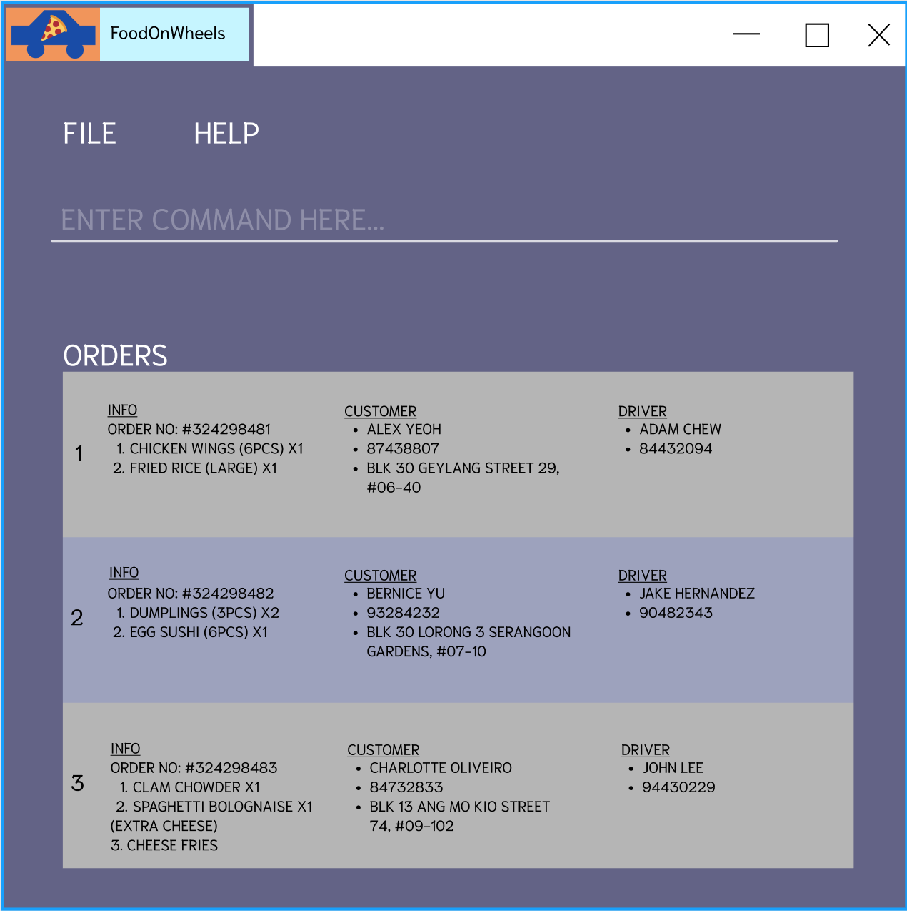

FoodOnWheels (FOW) is a **desktop app for managing delivery orders, optimized for use via a Command Line Interface** (CLI) while still having the benefits of a Graphical User Interface (GUI). If you can type fast, FOW can get your order management tasks done faster than traditional GUI apps.

This project is based on the AddressBook-Level3 project created by the [SE-EDU initiative](https://se-education.org).

* Table of Contents
{:toc}

--------------------------------------------------------------------------------------------------------------------

## Quick start

1. Ensure you have Java `11` or above installed in your Computer.

2. Download the latest `foodonwheels.jar` from [here](https://github.com/AY2122S2-CS2103-F10-2/tp) (to be updated).

3. Copy the file to the folder you want to use as the _home folder_ for your FoodOnWheels.

4. Double-click the file to start the app. The GUI similar to the below should appear in a few seconds. Note how the app contains some sample data. 
   (to be updated)

   

5. Type the command in the command box and press Enter to execute it. e.g. typing **`help`** and pressing Enter will open the help window. 
   
6. Some data has been added for you to try the app. Please use command `clear` to use your own data.
### Some example commands you can try:

### Commands relating to `Dish`
   * **`adddish`**`n/Crab Pasta $/15.50` : Adds a dish named `Crab Pasta` with price `15.50` to the restaurant's menu.

   * **`deletedish`**`1` : Deletes a dish named with index 1 displayed on filtered dish list.
   
   * **`listdish`** : Lists all existing dishes on restaurant's menu.

### Commands relating to `Order`

   * **`addorder`**`p/98765432 d/Sushi, Pasta` : Adds an order of `Sushi, Pasta` for customer with phone number `98765432`.

   * **`mark`**`1 s/delivered` : Edits the status of the order at index `1` to `delivered`.

   * **`listorder all`** : Lists all the current orders in the system. 

   * **`listorder in progress`** : Lists all the in-progress orders in the system.

### Commands relating to `Driver`
* **`adddriver`**`n/Joe p/98765432` : Adds a new driver with name `Joe` and phone number `98765432`.

* **`deletedriver`**`1` : Deletes the driver at index `1`.

* **`editdriver`**`1 s/absent` : Edits the status of the driver at index `1` to `absent`.

* **`listdriver all`** : Lists all the drivers in the system.

* **`listdriver free`** : Lists all the free drivers in the system.

### Commands relating to `Customer`
* **`addcustomer`**`n/Joe p/98765432 a/home` : Adds a new driver with name `Joe` and phone number `98765432`.

* **`deletecustomer`**`1` : Deletes the customer at index `1`.

* **`editcustomer`**`1 n/Jack` : Edits the customer at index `1` and replaces name with `Jack`.

* **`listcustomer`** : Lists all the customers in the system.

1. Refer to the [Features](#features) below for details of each command.

--------------------------------------------------------------------------------------------------------------------

## Features 

**:information_source: Notes about the command format:** 

* Words in `UPPER_CASE` are the parameters to be supplied by the user. 
  e.g. in `adddish n/NAME $/PRICE`, `name` and `price` are parameters which can be used as `adddish n/Crab Pasta $/15.50`.

* Items in square brackets are optional. 
  e.g `n/NAME [t/TAG]` can be used as `n/John Doe t/friend` or as `n/John Doe`.

* Items with `…`​ after them can have multiple inputs. 
  e.g. `t/friend`, `t/friend, family` etc.

* Parameters can be in any order. 
  e.g. if the command specifies `n/NAME p/PHONE`, `p/PHONE n/NAME` is also acceptable.

* If a parameter is expected only once in the command but you specified it multiple times, only the last occurrence of the parameter will be taken. 
  e.g. if you specify `p/81232323 p/91823232`, only `p/56785678` will be taken.

* Extraneous parameters for commands that do not take in parameters (such as `help`, `listdish`, `exit` and `clear`) will be ignored. 
  e.g. if the command specifies `help 123`, it will be interpreted as `help`.

## Customer features

### Adding a customer: `addcustomer`

Adds a customer to the database.

Format: `addcustomer n/{name} a/{address} p/{phone}`

Examples:
* `addcustomer n/John Doe a/John street, block 123, #01-01 p/98765432`
* `addcustomer n/Betsy Crowe a/Newgate Prison p/82943423`

### Deleting a customer: `deletecustomer`

Deletes a customer from the database.

Format: `deletecustomer {index}`

Examples:
* `deletecustomer 1`

### Editing a customer: `editcustomer`

Edits a customer from the database.

Format: `editcustomer {index} n/{name} p/{phone} a/{address}`

Examples:
* `editcustomer 1 n/John Doe a/Sentosa Cove`
* `editcustomer 3 p/81234567 a/Sentosa Cove`
* `editcustomer 2 n/John Doe p/81234567`

### Editing a customer: `editcustomer`

Lists all customers from the database.

Format: `listcustomer`

## Driver features

### Adding a driver: `adddriver`

Adds a driver to the database.

Format: ` adddriver n/NAME p/PHONE`

Examples:
* `adddriver n/John Doe p/98765432 `
* `adddriver n/Betsy Crowe p/82345671 `

### Deleting a driver: `deletedriver`

Deletes a driver from the database, together with his/her information.

Format: `deletedriver INDEX`, where `INDEX` denotes the index of the drivers.
* Please use the index `INDEX` shown from the list retrieved from the command `listdriver all`

Examples:
* `deletedriver 1`

### List all drivers: `listdriver all`

Lists all drivers in the database.

Format: `listdriver all`

### List driver with specific status: `listdriver`

Lists drivers having a specific status at that time.

Format: `listdriver [STATUS]`

Action | Feature type  
--------|--------------  
**FREE** | Drivers who are not delivering any order and can receive new orders.
**BUSY** | Drivers who are delivering order and cannot receive new orders.
**ABSENT** | Drivers who are out of work and cannot receive new orders.

Examples:
* `listdriver free`

### Editing a driver: `editdriver`

Edits a driver's information

Format: `editdriver INDEX [n/NAME] [p/PHONE] [s/STATUS]`, where `INDEX` denotes the index of the drivers.
* Please use the index `INDEX` shown from the list retrieved from the command `listdriver all`
* `STATUS` cannot be changed to `BUSY`.
* `STATUS` only can be changed when the driver is `FREE`.

Examples:
* `editdish 1 n/Adam`
* `editdish 2 p/99998888`
* `editdish 2 s/absent`
## Dish features

### Adding a dish: `adddish`

Adds a dish to the restaurant’s menu. Dishes of the same name cannot be added.

Format: `adddish n/NAME $/PRICE`

Examples:
* `add dish n/Crab Pasta $/15.50`
* `add dish n/Kimchi Fried Rice $/10.00`

### Deleting a dish: `deletedish`

Deletes a dish from the restaurant’s menu.

Format: `deletedish INDEX`, where `INDEX` denotes the index of the dish shown on FoodOnWheels

Examples:
* `deletedish 1`
* `deletedish 2`

### Editing a dish: `editdish`

Edits a dish from the restaurant’s menu.

Format: `editdish INDEX [n/NAME] [$/PRICE]`, where `INDEX` denotes the index of the dish shown on FoodOnWheels

Examples:
* `editdish 1 n/Limchi Fried Rice`
* `editdish 2 $/10.00`
* `editdish 2 n/Limchi Fried Rice $/10.00`

## Order Features

### Adding a new Delivery Order: `addorder`

Adds a new delivery order to the list of orders.

Format: `addorder p/PHONE d/DISHES_SEPARATED_BY_COMMA...`

Examples:
* `addorder p/81234567 d/Fried Rice, Pasta`
* `addorder p/86471627 d/Sushi`

### Edit the status of a Delivery Order: `mark`

Edit the status of a delivery order in the list using its index.

Format: `mark INDEX s/STATUS`

Examples:
* `mark 1 s/delivered`
* `mark 3 s/in progress`

### Edit the details of a Delivery Order: `editorder`

Edit the customer and dishes details of a delivery order in the list using its index.

Format: `editorder INDEX [p/PHONE] [d/DISHES_SEPARATED_BY_COMMA...]`

Examples:
* `editorder 1 p/87264512 d/kimchi, fried rice`
* `editorder 3 p/87654321`

### Search for an Order by Phone Number: `findorder`

Search for an order with the phone number provided in the list of orders.

Format: `find p/PHONE`

Examples:
* `find p/81234567`

### Listing orders: `listorder`

Lists the orders in the system based on the keyword entered.

Format: `listorder KEYWORD`. KEYWORD is one of 'all', 'in_progress' 
OR 'in progress', 'delivered', 'cancelled' (not case-sensitive)

### Revenue for the day: `revenue`

Obtains revenue generated in the current day based on the date 
on the operating system. All orders in FoodOnWheels will be listed.

Format: `revenue`

(to be updated)
### Viewing help : `help`

Shows a message explaning how to access the help page.

Format: `help`

### Exiting the program : `exit`

Exits the program.

Format: `exit`

### Saving the data

FoodOnWheels data are saved in the hard disk automatically after any command that changes the data. There is no need to save manually.

### Editing the data file

FoodOnWheels data are saved as a JSON file `[JAR file location]/data/addressbook.json` (to be updated). Advanced users are welcome to update data directly by editing that data file.

:exclamation: **Caution:**
If your changes to the data file makes its format invalid, AddressBook will discard all data and start with an empty data file at the next run.

### Archiving data files `[coming in v2.0]`

_Details coming soon ..._

--------------------------------------------------------------------------------------------------------------------

## FAQ

**Q**: How do I transfer my data to another Computer? 
**A**: Install the app in the other computer and overwrite the empty data file it creates with the file that contains the data of your previous FoodOnWheels home folder.

--------------------------------------------------------------------------------------------------------------------

## Command summary
(to be updated)

Action | Feature type | Format, Examples
--------|--------------|------------------
**Add** | **Customer** |`addcustomer n/NAME a/ADDRESS p/PHONE`   e.g,`addcustomer n/James Ho a/123, Clementi Rd, 1234665 p/88884444`
**Delete** | **Customer** |`deletecustomer INDEX`   e.g,`deletecustomer 1`
**Edit** | **Customer** |`editcustomer INDEX [n/NAME] [a/ADDRESS] [p/PHONE]`  e.g,`editcustomer 1 n/James Ho a/123, Clementi Rd, 1234665 p/99994444`
**Add** | **Driver**   |`adddriver n/NAME p/PHONE`   e.g,`add driver n/John Doe p/98765432`
**Delete** | **Driver**   |`deletedriver n/NAME p/PHONE`   e.g,`delete driver n/John Doe p/98765432`
**List (all drivers)** | **Driver**   |`listdriver all` 
**List** | **Driver**   |`listdriver [STATUS]`   e.g `listdriver free`
**Edit** | **Driver** |``editdriver INDEX [n/NAME] [p/PHONE] [s/STATUS]``  e.g,`editdriver 3 s/absent`
**Add** | **Dish**     | `adddish n/NAME $/PRICE`   e.g., `adddish n/Crab Pasta $/15.50`
**Delete** | **Dish**     | `deletedish INDEX`   e.g., `deletedish 1`
**Add** | **Order**    | `addorder p/PHONE d/DISHES_SEPARATED_BY_COMMA…`   e.g., `addorder p/82224567 d/kimchi fried rice, sushi`
**Edit** | **Order (status)** | `mark INDEX s/STATUS`   e.g., `mark 1 s/delivered` 
**Edit** | **Order** | `editorder INDEX [p/PHONE] [d/DISHES_SEPARATED_BY_COMMA...]`   e.g., `editorder 2 p/675827361 d/burger`
**Find** | **Order** | `find p/PHONE`   e.g., `find p/87654321`
**List (all orders)** | **Order**    | `listorder all` (keyword `all` not case-sensitve)
**List (in-progress orders)** | **Order**    | `listorder in progress` OR `listorder in_progress` (keyword `in progress` OR `in_progress` not case-sensitve)
**List (delivered orders)** | **Order**    | `listorder delivered` (keyword `delivered` not case-sensitve)
**List (cancelled orders)** | **Order**    | `listorder cancelled` (keyword `cancelled` not case-sensitve)
**Revenue (for the day)** | **Order**    | `revenue`

[//]: # (**Add** |              | `add n/NAME p/PHONE_NUMBER e/EMAIL a/ADDRESS [t/TAG]…​`   e.g., `add n/James Ho p/22224444 e/jamesho@example.com a/123, Clementi Rd, 1234665 t/friend t/colleague`)

[//]: # (**Clear** |              | `clear`                                                                                                                     )

[//]: # (**Delete** |              | `delete INDEX`  e.g., `delete 3`                                                                                         )

[//]: # (**Edit** |              | `edit INDEX [n/NAME] [p/PHONE_NUMBER] [e/EMAIL] [a/ADDRESS] [t/TAG]…​`  e.g.,`edit 2 n/James Lee e/jameslee@example.com` )

[//]: # (**Find** |              | `find KEYWORD [MORE_KEYWORDS]`  e.g., `find James Jake`                                                                  )

[//]: # (**List** |              | `list`                                                                                                                      )

[//]: # (**Help** |              | `help`                                                                                                                      )
