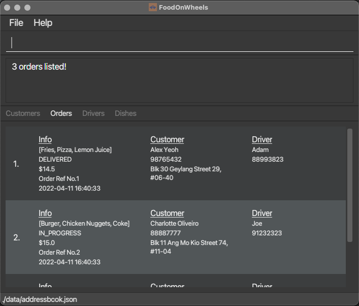
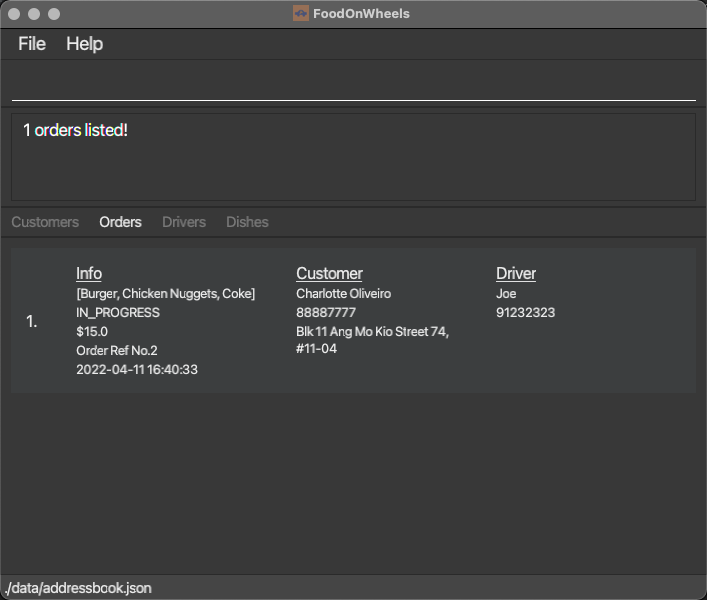
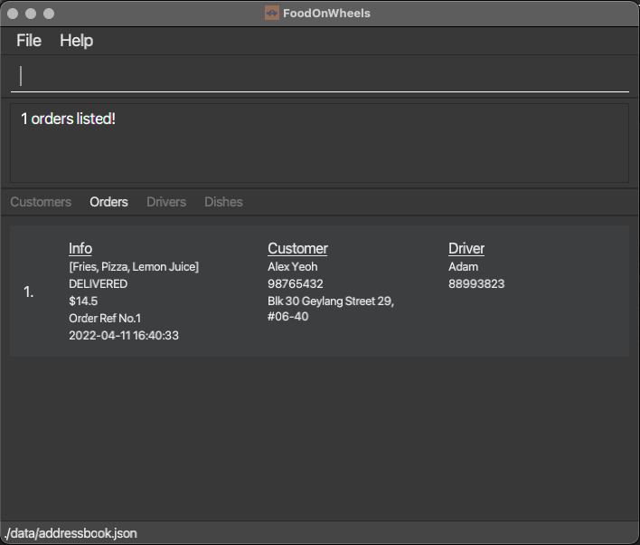
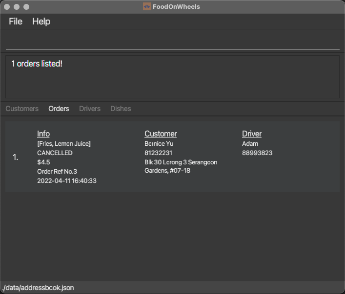
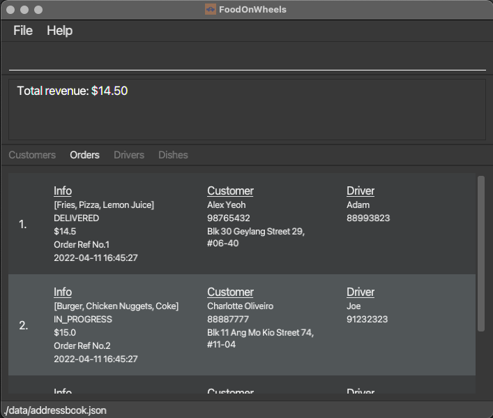

FoodOnWheels (FOW) is a **desktop app for managing delivery orders, 
optimized for use via a Command Line Interface** (CLI) while still having the benefits 
of a Graphical User Interface (GUI). 
If you can type fast, FOW can get your order management tasks done faster 
than traditional GUI apps.

The main idea of FOW is to allow for easier management of a single restaurant's delivery status.
FOW stores the information of customers, drivers, dishes and all previous and current orders, with
the provided ability for restaurants to make edits and deletions where necessary.

A secondary function of FOW would be for revenue tracking, where the current day's revenue can be
generated with a simple command.

This project is based on the AddressBook-Level3 project created by the [SE-EDU initiative](https://se-education.org).

## Table of Contents
1. [Quick start](#1-quick-start)
2. [Features](#2-features)  
   2.1 [Customer features](#21-customer-features)  
   2.2 [Driver features](#22-driver-features)  
   2.3 [Dish features](#23-dish-features)  
   2.4 [Order features](#24-order-features)
3. [FAQ](#3-faq)
4. [Command summary](#4-command-summary)

--------------------------------------------------------------------------------------------------------------------

## 1. Quick start

1. Ensure you have Java `11` or above installed in your Computer. 
   1. The official Oracle version of Java `11` can be found [here](https://www.oracle.com/java/technologies/downloads/#java11). 
   2. If the Oracle version is not compatible, or if the text in the GUI appears unreadable,
   the Azul build of OpenJDK `11` can be an alternative, 
   which can be found [here](https://www.azul.com/downloads/?version=java-11-lts&os=macos&architecture=arm-64-bit&package=jdk-fx) 
   (scroll to the bottom of the page).

2. Download the latest `foodonwheels.jar` from [here](https://github.com/AY2122S2-CS2103-F10-2/tp/releases).

3. Copy the file to the folder you want to use as the _home folder_ for your FoodOnWheels. 
Ensure that the folder has permissions for the app to create files (i.e. do not use a write-protected
folder). 

4. Double-click the file to start the app. The GUI similar to the below should appear in a few seconds. Note how the app contains some sample data. 
   1. If double-clicking the file does not work, use the command `java -jar foodonwheels.jar` from the
   folder containing `foodonwheels.jar` (assuming you saved the file as `foodonwheels.jar`).

5. The UI shows four different tabs: `Customers`, `Orders`, `Drivers` and `Dishes`.
   1. To switch between the tabs, enter any command relating to the tab (i.e. an `adddish` 
   command changes the tab to `Dishes`, likewise for others). The available and 
   detailed usage of each command can be found in [Features](#2-features).
   
6. Type the command in the command box and press Enter to execute it. e.g. typing **`help`** and pressing Enter will open the help window. 

7. Some data has been added for you to try the app. Please use command `clear` to use your own data.

## Some example commands you can try:

### Commands relating to `Dish`
* **`adddish`**`n/Crab Pasta $/15.50` : Adds a dish named `Crab Pasta` with price `15.50` to the restaurant's menu.

* **`deletedish`**`1` : Deletes a dish named with index 1 displayed on filtered dish list.

* **`listdish`** : Lists all existing dishes on restaurant's menu.

### Commands relating to `Driver`
* **`adddriver`**`n/Joe p/98765432` : Adds a new driver with name `Joe` and phone number `98765432`.

* **`deletedriver`**`1` : Deletes the driver at index `1`.

* **`editdriver`**`1 s/absent` : Edits the status of the driver at index `1` to `absent`.

* **`listdriver all`** : Lists all the drivers in the system.

* **`listdriver free`** : Lists all the free drivers in the system.

### Commands relating to `Customer`
* **`addcustomer`**`n/Joe p/98765432 a/home` : Adds a new driver with name `Joe` and phone number `98765432`.

* **`deletecustomer`**`1` : Deletes the customer at index `1`.

* **`editcustomer`**`1 n/Jack` : Edits the customer at index `1` and replaces name with `Jack`.

* **`listcustomer`** : Lists all the customers in the system.

### Commands relating to `Order` 

* *These commands can only be done after the above commands for Dish, Driver and Customer have been performed.
This is due to preconditions required for Order, which are explained in the [Order features](#24-order-features) section.*

* **`addorder`**`p/98765432 d/Crab Pasta` : Adds an order of `Crab Pasta` for customer with phone number `98765432`.

* **`mark`**`1 s/delivered` : Edits the status of the order at index `1` to `delivered`.

* **`listorder all`** : Lists all the current orders in the system.

* **`listorder in progress`** : Lists all the in-progress orders in the system.

Refer to the [Features](#2-features) below for details of each command.

--------------------------------------------------------------------------------------------------------------------

## 2. Features

**:information_source: Notes about the command format:** 

* Words in `UPPER_CASE` are the parameters to be supplied by the user. 
  e.g. in `adddish n/NAME $/PRICE`, `name` and `price` are parameters which can be used as `adddish n/Crab Pasta $/15.50`.

* Items in square brackets are optional. 
  e.g `INDEX [n/NAME] [p/PHONE]` can be used as `1 n/John Doe` or as `1 n/John Doe p/81234567`.

* Items with `…`​ after them can have multiple inputs. 
  e.g. `d/Sushi`, `d/Sushi, Kimchi Fried Rice` etc.

* Parameters can be in any order. 
  e.g. if the command specifies `n/NAME p/PHONE`, `p/PHONE n/NAME` is also acceptable.

* If a parameter is expected only once in the command but you specified it multiple times, only the last occurrence of the parameter will be taken. 
  e.g. if you specify `p/81232323 p/91823232`, only `p/91823232` will be taken.

* Extraneous parameters for commands that do not take in parameters (such as `help`, `listdish`, `exit` and `clear`) will be ignored. 
  e.g. if the command specifies `help 123`, it will be interpreted as `help`.

## 2.1 Customer features

### Adding a customer: `addcustomer`

Adds a customer to the database.

`(Existing names or phone numbers will not be added to prevent duplicates)`

Format: `addcustomer n/NAME p/PHONE a/ADDRESS `

Examples:
* `addcustomer n/John Doe  p/98765432 a/John street, block 123, #01-01`
* `addcustomer n/Betsy Crowe p/82943423 a/Newgate Prison `

Sample screenshot:

### Deleting a customer: `deletecustomer`

Deletes a customer from the database.

Format: `deletecustomer INDEX`

Examples:
* `deletecustomer 1`

Sample screenshot:

### Editing a customer: `editcustomer`

Edits a customer from the database.

`(Existing names or phone numbers will not be added to prevent duplicates)`

Format: `editcustomer INDEX [n/NAME] [p/PHONE] [a/ADDRESS]`

Examples:
* `editcustomer 1 n/John Doe a/Sentosa Cove`
* `editcustomer 3 p/81234567 a/Sentosa Cove`
* `editcustomer 2 n/John Doe p/81234567`

Note: If a customer was previously added into an order, the edit will not affect the customer snapshot captured in the order.
This is because it will affect previous records, which is an unwanted situation.

Sample screenshot:

### List a customer: `listcustomer`

Lists all customers from the database.

Format: `listcustomer`

Sample screenshot:

## 2.2 Driver features

### Adding a driver: `adddriver`

Adds a driver to the database. 

`(Existing names or phone numbers will not be added to prevent duplicates)`

Note: Drivers should not have the same phone number as an existing customer as phone numbers are unique in FOW.

Format: `adddriver n/NAME p/PHONE`

Examples:
* `adddriver n/John Doe p/98765432 `
* `adddriver n/Betsy Crowe p/82345671 `

Sample screenshot:

### Deleting a driver: `deletedriver`

Deletes a driver from the database, together with his/her information.

Format: `deletedriver INDEX`, where `INDEX` denotes the index of the drivers.

Examples:
* `deletedriver 1`

Sample screenshot:

### List all drivers: `listdriver all`

Lists all drivers in the database.

Format: `listdriver all`

Sample screenshot:

### List driver with specific status: `listdriver`

Lists drivers having a specific status at that time.

Format: `listdriver STATUS`

Action | Feature type
--------|--------------  
**FREE** | Drivers who are not delivering any order and can receive new orders.
**BUSY** | Drivers who are delivering order and cannot receive new orders.
**ABSENT** | Drivers who are out of work and cannot receive new orders.

Examples:
* `listdriver free`

Sample screenshot:

### Editing a driver: `editdriver`

Edits a driver's information

`(Existing names or phone numbers will not be added to prevent duplicates)`

Format: `editdriver INDEX [n/NAME] [p/PHONE] [s/STATUS]`, where `INDEX` denotes the index of the drivers.
* `STATUS` cannot be changed to `BUSY`.
* `STATUS` only can be changed when the driver is not `BUSY`.

Examples:
* `editdriver 1 n/Adam`
* `editdriver 2 p/99998888`
* `editdriver 2 s/absent`

Note: If a driver was previously added into an order, the edit will not affect the driver snapshot captured in the order.
This is because it will affect previous records, which is an unwanted situation.

Sample screenshot:

## 2.3 Dish features

### Adding a dish: `adddish`

Adds a dish to the restaurant’s menu. Dishes of the same name cannot be added.

Format: `adddish n/NAME $/PRICE`

Examples:
* `adddish n/Crab Pasta $/15.50`
* `adddish n/Kimchi Fried Rice $/10.00`

Sample screenshot:

### Deleting a dish: `deletedish`

Deletes a dish from the restaurant’s menu.

Format: `deletedish INDEX`, where `INDEX` denotes the index of the dish shown on FoodOnWheels

Examples:
* `deletedish 1`
* `deletedish 2`

Sample screenshot:

### Editing a dish: `editdish`

Edits a dish from the restaurant’s menu.

Format: `editdish INDEX [n/NAME] [$/PRICE]`, where `INDEX` denotes the index of the dish shown on FoodOnWheels

Examples:
* `editdish 1 n/Kimchi Fried Rice`
* `editdish 2 $/10.00`
* `editdish 2 n/Limchi Fried Rice $/10.00`

Note: If a dish was previously added into an order, the edit will not affect the dish snapshot captured in the order.
This is because it will affect previous records, which is an unwanted situation.

Sample screenshot:

## 2.4 Order Features

### Adding a new Delivery Order: `addorder`

Adds a new delivery order to the list of orders. 

Pre-condition: 
1. The phone number provided belongs to an existing customer
2. The dishes provided exist in the current dish list
3. There exists at least one free driver.

Format: `addorder p/PHONE d/DISHES_SEPARATED_BY_COMMA...`

Examples:
* `addorder p/81234567 d/Fried Rice, Pasta`
* `addorder p/86471627 d/Sushi`

Sample screenshot:

### Edit the status of a Delivery Order: `mark`

Edit the status of a delivery order in the list using its index.

When attempting to edit a delivered Order back to being in progress, the original driver must be available.
Else, please create a new Order so that a new driver can be assigned.

Format: `mark INDEX s/STATUS`

Examples:
* `mark 1 s/delivered`
* `mark 3 s/in progress`

Sample screenshot:

### Edit the details of a Delivery Order: `editorder`

Edit the customer and dishes details of a delivery order in the list using its index.
The same pre-conditions of AddOrder applies to this command as well.

Format: `editorder INDEX [p/PHONE] [d/DISHES_SEPARATED_BY_COMMA...]`

Examples:
* `editorder 1 p/87264512 d/kimchi, fried rice`
* `editorder 3 p/87654321`

### Search for Orders by Phone Number: `findorder`

Search for orders with the customer phone number(s) provided in the list of orders.

Format: `findorder p/PHONE_SEPARATED_BY_SPACE...`

Examples:
* `findorder p/81234567`
* `findorder p/81234567 98765432`

Sample screenshot:

### Listing orders: `listorder`

Lists the orders in the system based on the keyword entered.

Format: `listorder KEYWORD`. KEYWORD is one of 'all', 'in_progress'
OR 'in progress', 'delivered', 'cancelled' (not case-sensitive)

Sample screenshot `listorder all`:

Sample screenshot `listorder in progress` OR `listorder in_progress`:

Sample screenshot `listorder delivered`:

Sample screenshot `listorder cancelled`:

### Revenue for the day: `revenue`

Obtains revenue generated in the current day based on the date
on the operating system. All orders in FoodOnWheels will be listed.

Format: `revenue`

Sample screenshot:

## 2.4 Other features
### Viewing help : `help`

Shows a message explaning how to access the help page.

Format: `help`

### Clearing all existing data : `clear`

Clears all existing customers / orders / drivers / dishes from FOW.

Format: `clear`

### Exiting the program : `exit`

Exits the program.

Format: `exit`

### Saving the data

FoodOnWheels data are saved in the hard disk automatically after any command that changes the data. There is no need to save manually.

### Editing the data file

FoodOnWheels data are saved as a JSON file `[JAR file location]/data/addressbook.json`. Advanced users are welcome to update data directly by editing that data file.

:exclamation: **Caution:**
If your changes to the data file makes its format invalid, AddressBook will discard all data and start with an empty data file at the next run.

### Archiving data files `[coming in v2.0]`

_Details coming soon ..._

--------------------------------------------------------------------------------------------------------------------

## 3. FAQ

**Q**: How do I transfer my data to another Computer? 
**A**: Install the app in the other computer and overwrite the empty data file it creates with the file that contains the data of your previous FoodOnWheels home folder.

--------------------------------------------------------------------------------------------------------------------

## 4. Command summary

Action | Feature type       | Format, Examples
--------|--------------------|------------------
**Add** | **Customer**       |`addcustomer n/NAME a/ADDRESS p/PHONE`   e.g,`addcustomer n/James Ho a/123, Clementi Rd, 1234665 p/88884444`
**Delete** | **Customer**       |`deletecustomer INDEX`   e.g,`deletecustomer 1`
**Edit** | **Customer**       |`editcustomer INDEX [n/NAME] [a/ADDRESS] [p/PHONE]`  e.g,`editcustomer 1 n/James Ho a/123, Clementi Rd, 1234665 p/99994444`
**List** | **Customer**       |`listcustomer`
**Add** | **Driver**         |`adddriver n/NAME p/PHONE`   e.g,`adddriver n/John Doe p/98765432`
**Delete** | **Driver**         |`deletedriver INDEX`   e.g,`deletedriver 1`
**List (all drivers)** | **Driver**         |`listdriver all`
**List** | **Driver**         |`listdriver STATUS`   e.g `listdriver free`
**Edit** | **Driver**         |``editdriver INDEX [n/NAME] [p/PHONE] [s/STATUS]``  e.g,`editdriver 3 s/absent`
**Add** | **Dish**           | `adddish n/NAME $/PRICE`   e.g., `adddish n/Crab Pasta $/15.50`
**Delete** | **Dish**           | `deletedish INDEX`   e.g., `deletedish 1`
**Edit** | **Dish**           | `editdish INDEX [n/NAME] [$/PRICE]`   e.g., `editdish 1 n/Kimchi Fried Rice $/10.00`
**List** | **Dish**           |`listdish`
**Add** | **Order**          | `addorder p/PHONE d/DISHES_SEPARATED_BY_COMMA…`   e.g., `addorder p/82224567 d/kimchi fried rice, sushi`
**Edit** | **Order (status)** | `mark INDEX s/STATUS`   e.g., `mark 1 s/delivered`
**Edit** | **Order**          | `editorder INDEX [p/PHONE] [d/DISHES_SEPARATED_BY_COMMA...]`   e.g., `editorder 2 p/675827361 d/burger`
**Find** | **Order**          | `find p/PHONE`   e.g., `find p/87654321`
**List (all orders)** | **Order**          | `listorder all` (keyword `all` not case-sensitve)
**List (in-progress orders)** | **Order**          | `listorder in progress` OR `listorder in_progress` (keyword `in progress` OR `in_progress` not case-sensitve)
**List (delivered orders)** | **Order**          | `listorder delivered` (keyword `delivered` not case-sensitve)
**List (cancelled orders)** | **Order**          | `listorder cancelled` (keyword `cancelled` not case-sensitve)
**Revenue (for the day)** | **Order**          | `revenue`
**Help** | -                  | `help`
**Clear the existing data** | -                  | `clear`
**Exit the app** | -                  | `exit`
