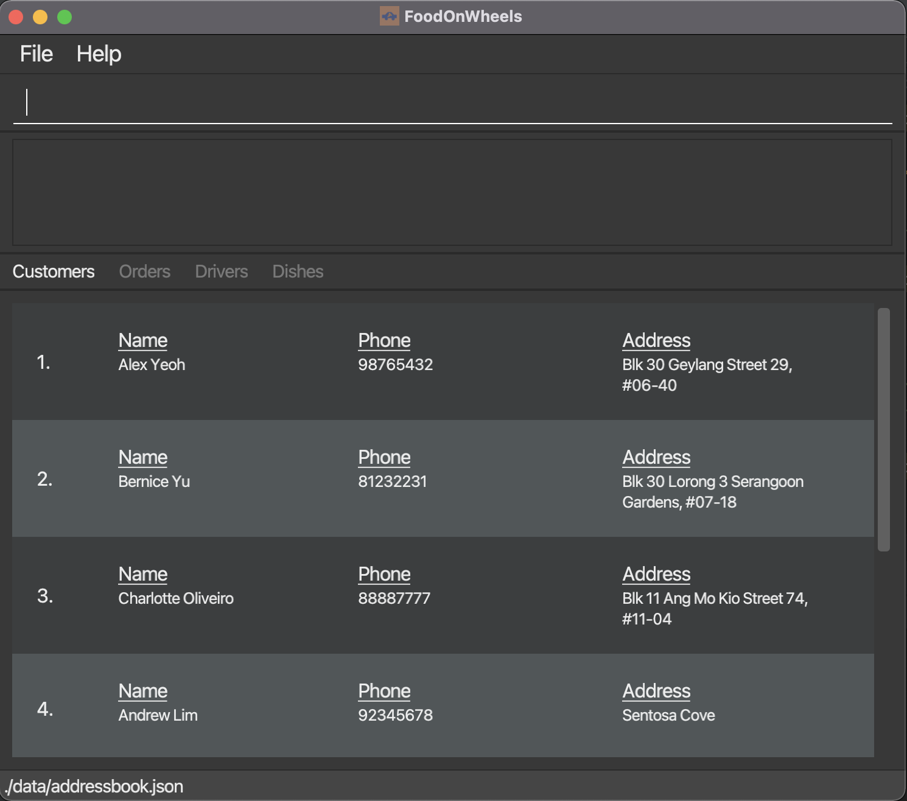

**FoodOnWheels is a desktop application for managing delivery orders.** While it has a GUI, most of the user interactions happen using a CLI (Command Line Interface).
 
* If you are interested in using FoodOnWheels, head over to the [_Quick Start_ section of the **User Guide**](UserGuide.html#quick-start).
* If you are interested about developing FoodOnWheels, the [**Developer Guide**](DeveloperGuide.html) is a good place to start.

**Overview**
* This is a project for **Food Delivery Management**. 
* The project simulates an ongoing software project for a desktop application (called _FoodOnWheels_) used for managing food deliveries.
    * It is **written in OOP fashion**. It provides a code base of around 15 KLoC.
    * It comes with a **reasonable level of user and developer documentation**.
* It is named `FoodOnWheels` (`FOW` for short) because it is made for the management of food deliveries.

**Acknowledgements**

* Libraries used: [JavaFX](https://openjfx.io/), [Jackson](https://github.com/FasterXML/jackson), [JUnit5](https://github.com/junit-team/junit5)
* This project is based on the AddressBook-Level3 project created by the [SE-EDU initiative](https://se-education.org).
